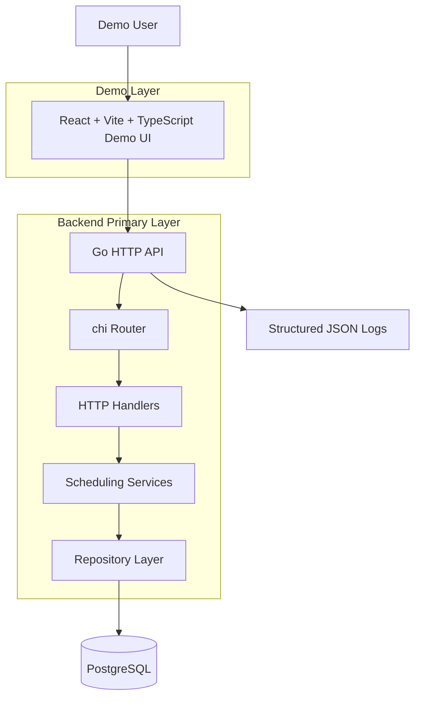
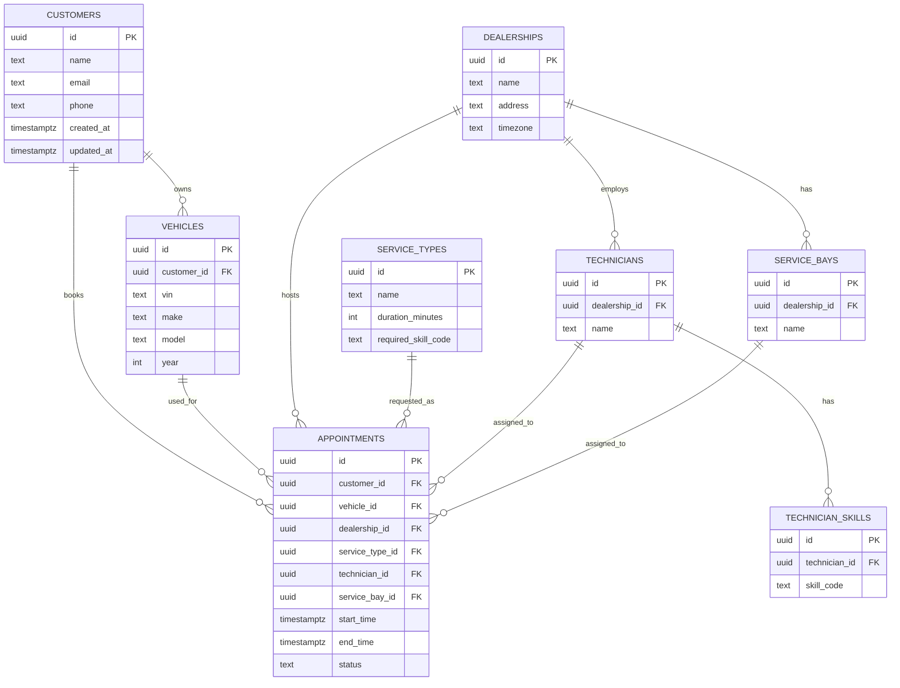
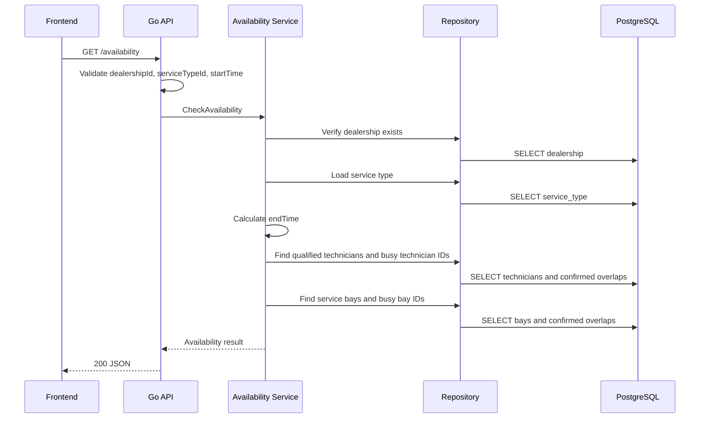
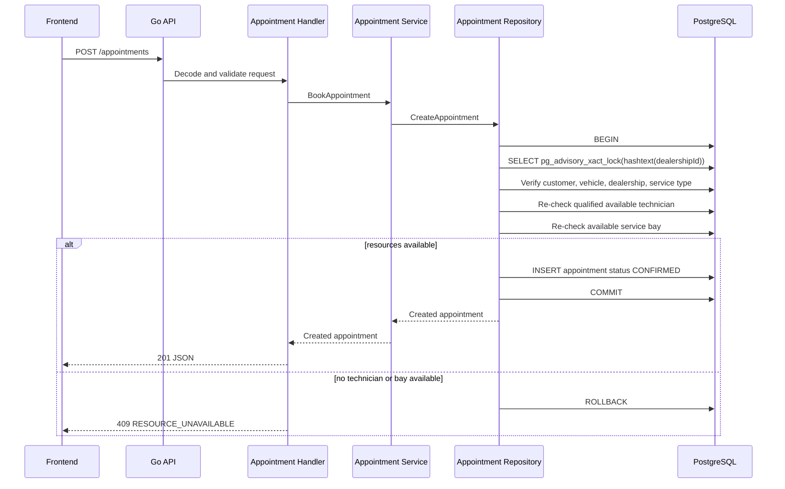

# Unified Service Scheduler - System Design

## 1. Problem Statement

Keyloop Scenario A asks for a unified service appointment scheduler for dealership servicing. The system must let a user select a customer, vehicle, dealership, service type, and start time, then determine whether a qualified technician and service bay are both available for the full service duration.

This repository implements a production-oriented MVP. The backend is the primary fully implemented layer. The frontend is a demo layer that exercises the end-to-end booking workflow.

## 2. Goals

- Provide a clean Go backend for reference data, availability checks, appointment creation, listing, detail, and cancellation.
- Model the core scheduling domain in PostgreSQL with migrations and stable seed data.
- Ensure appointment creation re-checks availability transactionally before inserting.
- Allow adjacent appointments while blocking true overlaps for confirmed appointments.
- Provide a React demo UI for booking, viewing, and cancelling appointments.
- Include tests for core scheduling logic, handler validation, and appointment repository behavior.

## 3. Non-Goals

- Full production authentication and authorization.
- Multi-dealership administration workflows.
- Calendar integrations, notification delivery, or customer messaging.
- Technician shift calendars, holidays, lunch breaks, or variable bay capabilities.
- Production-grade conflict prevention with PostgreSQL exclusion constraints.
- A production-ready frontend design system.

## 4. Assumptions

- Each service type has a fixed duration in minutes.
- Each service type requires exactly one skill code.
- A technician can perform a service if they have the required skill code.
- Any service bay at the selected dealership can host any service.
- Only `CONFIRMED` appointments block availability.
- `CANCELLED` and `COMPLETED` appointments do not block availability.
- Times are submitted as RFC3339 timestamps and stored as `TIMESTAMPTZ`.
- The seeded dealership uses stable UUIDs so demos and tests can reference known records.

## 5. Architecture Overview



The backend owns validation, scheduling decisions, transactional booking, persistence, and response shaping. The frontend does not contain business rules; it calls backend APIs and presents loading, empty, error, success, and conflict states.

## 6. Component Responsibilities

- `backend/cmd/api`: application entry point, configuration loading, server startup.
- `backend/internal/http`: route registration, handlers, shared JSON responses, middleware.
- `backend/internal/scheduling`: availability and appointment domain services.
- `backend/internal/repository`: PostgreSQL access through pgx pool and transactions.
- `backend/db/migrations`: schema definition and rollback.
- `backend/db/seed.sql`: stable demo data for local testing and review.
- `frontend/src/api`: typed API client.
- `frontend/src/pages`: booking, appointment list, and appointment detail views.
- `docs`: design and AI collaboration narrative.

## 7. Data Model



Important constraints include positive service durations, vehicle years greater than 1900, appointment end time after start time, valid appointment statuses, UUID primary keys, and foreign keys across all appointment relationships.

## 8. API Design

Reference APIs:

- `GET /dealerships`
- `GET /customers`
- `GET /customers/{customerId}/vehicles`
- `GET /service-types`
- `GET /technicians?dealershipId=`
- `GET /service-bays?dealershipId=`

Scheduling APIs:

- `GET /availability?dealershipId=&serviceTypeId=&startTime=`
- `POST /appointments`
- `GET /appointments`
- `GET /appointments/{appointmentId}`
- `PATCH /appointments/{appointmentId}/cancel`

Responses are JSON and frontend-friendly. Invalid UUIDs and missing required parameters return `400`. Unknown resources return `404`. Resource conflicts return `409`. Unexpected failures return `500` with a generic client-facing message.

## 9. Scheduling and Availability Logic

Availability is based on both technician and service bay availability for the entire service duration.

The overlap rule is:

```sql
existing.start_time < new_end
AND existing.end_time > new_start
AND existing.status = 'CONFIRMED'
```

This means adjacent appointments are allowed. For example, an existing appointment from 09:00 to 10:00 does not conflict with a new appointment from 10:00 to 11:00. Only `CONFIRMED` appointments block resources; `CANCELLED` and `COMPLETED` appointments do not.

`GET /availability` is a snapshot for user experience. It helps users select a plausible slot, but it is not the source of truth for booking.



## 10. Appointment Booking Flow

`POST /appointments` is the source of truth. The backend validates the request, verifies relationships, calculates the end time from service type duration, and performs the availability re-check inside a PostgreSQL transaction before inserting.



Cancellation sets an appointment to `CANCELLED`. A cancelled appointment no longer blocks future availability or booking. A completed appointment cannot be cancelled.

## 11. Concurrency and Consistency Strategy

The MVP uses a pragmatic transaction strategy:

- Start a PostgreSQL transaction for appointment creation.
- Acquire a transaction-level advisory lock scoped to `dealershipId`.
- Re-check technician and bay availability inside the same transaction.
- Insert and commit only if both resources are still available.
- Roll back on all error paths.

The advisory lock statement is:

```sql
SELECT pg_advisory_xact_lock(hashtext($1::text));
```

This reduces double-booking races within a dealership while keeping the implementation understandable for the assessment. A production-grade improvement would add PostgreSQL exclusion constraints using `tstzrange(start_time, end_time)` so the database itself rejects conflicting resource assignments.

## 12. Observability Strategy

The backend uses minimal structured JSON logs for request handling and scheduling events. Logged events include:

- `availability_check_started`
- `availability_check_completed`
- `availability_check_failed`
- `appointment_booking_started`
- `appointment_booking_conflict`
- `appointment_created`
- `appointment_cancelled`
- `appointment_booking_failed`

The next production step would add request IDs, metrics, tracing, and structured error classification across repository and handler boundaries.

## 13. Technology Choices

- Go: small, explicit backend with strong standard library support.
- chi: lightweight HTTP router with clear middleware and route grouping.
- pgx pool: idiomatic PostgreSQL driver and connection pooling for Go.
- PostgreSQL: relational integrity, transactions, indexes, and future range constraints.
- golang-migrate: simple migration workflow.
- React, Vite, TypeScript: fast demo UI with typed API integration.
- Tailwind CSS: lightweight styling without a heavy component framework.

## 14. Testing Strategy

The project includes:

- Unit tests for interval overlap logic, including adjacent slots.
- Scheduling service tests for validation and availability outcomes.
- Handler tests for request validation and status mapping.
- Repository integration tests for transactional booking behavior when enabled with a temporary PostgreSQL database.
- Frontend TypeScript production build verification.

The core correctness focus is appointment creation, conflict handling, cancellation behavior, and the rule that cancelled and completed appointments do not block resources.

## 15. Security Considerations

Current MVP security is intentionally limited. The system avoids leaking raw database errors to clients and uses parameterized SQL through pgx. Required future controls include authentication, authorization, rate limiting, CORS policy review, input size limits, secrets management, TLS, audit logging, and customer data privacy controls.

## 16. Scalability and Reliability Considerations

The current design can scale vertically and by running multiple API instances against PostgreSQL. The dealership-scoped advisory lock limits concurrent booking writes per dealership, which is acceptable for an MVP but should be monitored. Useful next steps include connection pool tuning, read pagination, database-level exclusion constraints, metrics, health/readiness checks, backups, and automated migration deployment.

## 17. GenAI-Assisted Design Process

AI assistance was used to accelerate scaffolding, implementation planning, migration creation, API implementation, frontend demo work, and targeted audits. The important correctness decisions were verified through code review and tests, especially the overlap rule, transaction boundary, advisory lock placement, cancellation behavior, and stale frontend availability handling.

## 18. Future Improvements

- Add PostgreSQL exclusion constraints for technician and service bay conflicts.
- Add business hours, technician shifts, holidays, and dealership-local scheduling rules.
- Add authentication and role-based access control.
- Add appointment rescheduling and completion workflows.
- Add pagination and richer filtering for appointment lists.
- Add OpenTelemetry tracing and metrics.
- Add CI workflows for backend tests, integration tests, and frontend builds.
- Improve frontend accessibility testing and end-to-end browser coverage.
